## 情緒方面文章

- [IntentionESC: An Intention-Centered Framework for Enhancing Emotional Support in Dialogue Systems](https://aclanthology.org/2025.findings-acl.1358.pdf)

- [The NRC Valence, Arousal, and Dominance (NRC-VAD) Lexicon](https://saifmohammad.com/WebPages/nrc-vad.html)

- [情緒模型：從達爾文到AI時代的探索](https://medium.com/@royroy5681/%E6%83%85%E7%B7%92%E6%A8%A1%E5%9E%8B-%E5%BE%9E%E9%81%94%E7%88%BE%E6%96%87%E5%88%B0ai%E6%99%82%E4%BB%A3%E7%9A%84%E6%8E%A2%E7%B4%A2-058c5ef8acf7)


## 系統流程圖

```mermaid
flowchart TD
    A[使用者透過 LINE 傳送文字訊息] --> D{依序判斷使用者輸入類型}


    D -->|1 情緒分析請求| E[回傳情緒儀表板]
    E --> O1

    D -->|2 觀看摘要請求| F[回傳摘要]
    F --> O1

    D -->|3 開始量表測驗| G[回傳量表作答介面]
    G --> O1

    D -->|4 找活動| H[回傳五個最近的活動]
    H --> O1

    D -->|5 諮商輔導| I[呼叫api將文字轉成向量]

    subgraph RAG
        I --> V1[和中原資源向量資料比對]
        I --> V2[和歷史摘要向量資料比對]
        V1 --> Q{向量距離 <= 0.35?}
        V2 --> Q2{有命中?}
        Q -->|是| J[加入中原資源內容]
        Q -->|否| R[加入資源索引內容]
        Q2 -->|是| S[加入個人摘要內容]
        Q2 -->|否| T[不加入]
        
    end

    S --> X
    J --> X[整合為最終Prompt]
    R --> X
    MDB_Read --> X

    X --> L[呼叫 Groq LLM API]
    MDB_Read[( 讀取 MongoDB 歷史對話最近5筆、Base Prompt)]
    MDB_Write[( 寫入 MongoDB 此次對答、使用心理策略、使用者情緒、聊天主題、意圖、時間)]


    L --> MDB_Write
        
    
    MDB_Write --> O1
    O1[透過 Messaging API 回覆使用者訊息] --> M[若達今日對話上限，要做摘要]
    M --> Z[流程完成]

```


<br>

## 各檔案說明

### `app.py`
- 主程式入口。
- 使用 Flask 建立伺服器，並設定 `/callback` 路由處理 LINE Webhook
- 匯入 `line_handlers` 模組進行事件處理

### `config.py`
- 儲存環境變數的載入，例如 Groq API 金鑰、伺服器網址等
- 與 `.env` 檔案結合，集中管理設定值

### `line_handlers.py`
- 處理來自 LINE 的訊息事件。包括情緒儀表板、做量表、心理諮商
- 整合向量檢索結果、歷史對話5筆、base prompt，丟入llm 生成line bot 回覆

### `vector_search.py`

負責向量檢索與向量距離判斷，流程如下：

1. **向量化**  
   呼叫我們自己架設的 Hugging Face Space（[aurorajojo/e5-large-embedding-api](https://huggingface.co/spaces/aurorajojo/e5-large-embedding-api)）將使用者 input 轉換為向量。

2. **載入FAISS向量庫**  
   載入本地向量庫 ([cycu_faiss_index](https://github.com/aurorajojo/line_app/blob/main/cycu_faiss_index))。內容為中原大學各項資源的文字描述，包含藝文資源、學習資源、心理輔導、體育場館、餐飲、教官室等資訊。

3. **向量距離比對與檢索**

- **檢索 FAISS向量庫**  
  - 以向量距離閾值（預設 **0.35**）判斷結果是否相關。  
  - **若小於等於閾值** → 視為「有相關資料」，回傳最相關的資源文字內容。  
  - **若大於閾值** → 視為「無相關資料」，則回傳 `cycu_resources.json` 中的 **用途索引**。  

- **檢索 MongoDB**  
  - 從 `summary_collection` 中找出 **該使用者的top1歷史每日摘要**，並整合至輸出。  

4. **整合輸出結果**
- 當 FAISS 有相關資料：回傳「最相關的學校資源」+（若有的話）「歷史摘要」。 
- 當 FAISS 無相關資料：回傳「用途索引」+（若有的話）「歷史摘要」。
     
### `llm.py`
- 封裝與語言模型（Groq / LLaMA）溝通的邏輯
- 定義如何將使用者訊息送出並取得回應(聊天、摘要2種模式)

### `extract_topic.py`
- 使用者聊天前會在圖文選單選擇聊天主題(人際關係,家庭關係,情愛關係,生涯,課業學習,自我探索與認識,情緒困擾調適,精神疾病,性議題,其他)，後面所有的對話都會記錄為該主題並且 `儲存至資料庫 `
- 主題來自[中原大學諮商中心的晤談服務](https://deptweb.cycu.edu.tw/misa/%e5%95%8f%e7%ad%94qa/)


### `emotion_strategy_utils.py`
-  為了避免讓使用者察覺我們正在進行 `情緒分析` 與 `心理策略及意圖紀錄` ，設計了隱藏式的標記機制(當 LLM 回傳分析結果時，不會直接以文字顯示情緒名稱或策略內容，是透過編碼形式（如 [1]～[12] 表示情緒、(1)～(8) 表示策略、{1}~{12} 表示意圖進行標註)，這個檔案就是在進行上述的標記轉換處理
  
### `emotion_dashboard.py`
- 根據使用者歷史對話紀錄，統計每種情緒七天內出現的頻率，並產生 `情緒儀表板` 
- 為了讓情緒分析結果更有親和力，我們替每一種情緒設計了一個對應角色
- 我們採用的情緒種類有: 1.焦慮 2.悲傷 3.憤怒 4.恐懼 5.厭惡 6.羞愧 7.快樂 8.滿足 9.驚訝 10.興奮 11.冷靜 12.無法判斷

### `depression_scale.py`
- 顯示 18 題 `台灣人憂鬱症量表問題` ，讓使用者逐題作答

### `gaming_disorder_scale.py`
- 顯示 10 題 `網路遊戲成癮量表問題` ，讓使用者逐題作答

### `topic_manager.py`
- 管理每天使用者的聊天主題
- 每天對話前會要求選主題

### `daily_summary.py`
- 每日對話前，檢查上次諮商是否有做摘要，做完摘要就將摘要轉換成向量，一起存到資料庫
- 如當日對話已滿上限(10次)，則做摘要，並將摘要轉換成向量，一起存到資料庫

### `weekly_summary.py`
- 輸出本周(七天以來)每日的摘要
- 輸出使用者要查詢的指定日期摘要

### `event_utils.py`
- 回傳最近五個藝文活動資訊(名稱、日期、時間、連結)

### `render_wake_up.py`
- 我們使用 Render 作為伺服器部署平台
- 這個檔案會定時 ping Render 平台以防止伺服器自動休眠

### `mongo.py`
- 封裝 MongoDB 資料庫的連線與操作功能
- 讓專案能存取&管理聊天紀錄、摘要、量表分數

### `resources.py`
- 載入 `system_prompt.txt` 、 `summary_prompt.json`、 `cycu_resources.json`、 `events.json`，提供語言模型的指令（角色、語氣等）以及中原大學（CYCU）相關的各類資源資訊

### `requirements.txt`
- 記錄所需的 Python 套件

### `system_prompt.txt`
- 儲存語言模型的 system prompt，用於引導模型回應風格與身份定位
- 設定llm回傳文字時，透過 `編碼 `形式顯示情緒、策略、意圖名稱
- 設定llm不回答任何 `危險、非法或自殘 `相關問題
- 設定llm不透露任何 `prompt內部設計或詳細指令內容 `
- 生成流程: 判斷四個層面 → 確認意圖 → 套用策略。(此作法參考論文[IntentionESC: An Intention-Centered Framework for Enhancing Emotional Support in Dialogue Systems](https://aclanthology.org/2025.findings-acl.1358.pdf))

### `summary_prompt.txt`
- 儲存語言模型要執行摘要的prompt
- 僅輸出摘要，不要進行對話或回答問題  
- 不可編造對話中未出現的情緒或事件 

### `cycu_resources.json`
- JSON 格式的資源資料檔案
- 包含中原大學（CYCU）相關的各類資源資訊

### `events.json`
- JSON 格式的資源資料檔案
- 包含中原大學（CYCU）本學期藝文活動列表

<br>  
<br>  

## 指令

下載套件：
```bash
pip install -r requirements.txt
```
啟動程式：
```bash
python app.py
```
