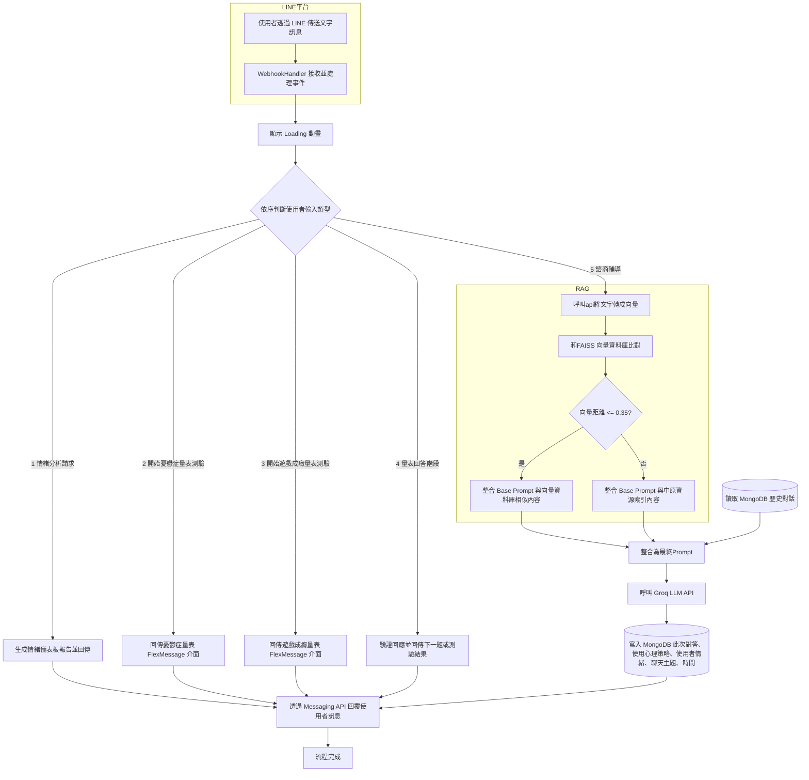

## 情緒方面文章

- [IntentionESC: An Intention-Centered Framework for Enhancing Emotional Support in Dialogue Systems](https://aclanthology.org/2025.findings-acl.1358.pdf)

- [The NRC Valence, Arousal, and Dominance (NRC-VAD) Lexicon](https://saifmohammad.com/WebPages/nrc-vad.html)

- [情緒模型：從達爾文到AI時代的探索](https://medium.com/@royroy5681/%E6%83%85%E7%B7%92%E6%A8%A1%E5%9E%8B-%E5%BE%9E%E9%81%94%E7%88%BE%E6%96%87%E5%88%B0ai%E6%99%82%E4%BB%A3%E7%9A%84%E6%8E%A2%E7%B4%A2-058c5ef8acf7)


## 系統流程圖


<br>

## 各檔案說明

### `app.py`
- 主程式入口。
- 使用 Flask 建立伺服器，並設定 `/callback` 路由處理 LINE Webhook。
- 匯入 `line_handlers` 模組進行事件處理。

### `config.py`
- 儲存環境變數的載入，例如 Groq API 金鑰、伺服器網址等。
- 與 `.env` 檔案結合，集中管理設定值。

### `line_handlers.py`
- 處理來自 LINE 的訊息事件。包括情緒儀表板、做量表、心理諮商。

### `vector_search.py`

負責向量檢索與向量距離判斷，流程如下：

1. **向量化**  
   呼叫我們自己架設的 Hugging Face Space（[aurorajojo/e5-large-embedding-api](https://huggingface.co/spaces/aurorajojo/e5-large-embedding-api)）將使用者 input 轉換為向量。

2. **載入向量庫**  
   透過 `FAISS.load_local()` 載入本地向量庫 ([cycu_faiss_index](https://github.com/aurorajojo/line_app/blob/main/cycu_faiss_index))。內容為中原大學各項資源的文字描述，包含藝文資源、學習資源、心理輔導、體育場館、餐飲、教官室等資訊。

4. **向量距離比對**  
   `query_vectorstore()` 執行檢索並判斷距離閾值（預設 0.35）：  
   - **符合閾值** → 回傳最相關資訊句子與向量距離分數，以便後續加入prompt回傳給大型語言模型。
   - **不符合** → 回傳 `cycu_resources.json` 中的用途索引，以便後續加入prompt回傳給大型語言模型。
     
### `llm.py`
- 封裝與語言模型（Groq / LLaMA）溝通的邏輯。
- 定義如何將使用者訊息送出並取得回應。

### `extract_topic.py`
- 使用者聊天前會在圖文選單選擇聊天主題(有7種)，後面所有的對話都會記錄為該主題並且 `儲存至資料庫 `
- 在每次使用者輸入文字後，判斷一次他是否更換主題
- 若沒有更換，則沿用上一句話的主題
- 如果資料庫為空，沒有歷史對話，就將主題先記錄為"其他"

### `emotion_strategy_utils.py`
-  為了避免讓使用者察覺我們正在進行 `情緒分析` 與 `心理策略紀錄` ，設計了隱藏式的標記機制(當 LLM 回傳分析結果時，不會直接以文字顯示情緒名稱或策略內容，是透過編碼形式（如 [1]～[8] 表示情緒、(1)～(8) 表示策略）進行標註)，這個檔案就是在進行上述的標記轉換處理
  

### `emotion_dashboard.py`
- 根據使用者歷史對話紀錄，統計每種情緒出現的頻率，並產生 `文字情緒儀表板` 。
- 為了讓情緒分析結果更有親和力，我們替每一種情緒設計了一個對應角色。

### `depression_scale.py`
- 顯示 18 題 `台灣人憂鬱症量表問題` ，讓使用者逐題作答。

### `gaming_disorder_scale.py`
- 顯示 10 題 `網路遊戲成癮量表問題` ，讓使用者逐題作答。

### `topic_manager.py`
- 管理每天使用者的聊天主題
- 每天午夜自動清空，隔天重新要求主題

### `render_wake_up.py`
- 我們使用 Render 作為伺服器部署平台。
- 這個檔案會定時 ping Render 平台以防止伺服器自動休眠。

### `mongo.py`
- 封裝 MongoDB 資料庫的連線與操作功能。
- 讓專案能存取、管理聊天紀錄或資源資料。

### `resources.py`
- 載入 `system_prompt.txt` 、 `cycu_resources.json`，提供語言模型的指令（角色、語氣等）以及中原大學（CYCU）相關的各類資源資訊。

### `requirements.txt`
- 記錄所需的 Python 套件。

### `system_prompt.txt`
- 儲存語言模型的 system prompt，用於引導模型回應風格與身份定位。
- 設定llm回傳文字時，透過 `編碼 `形式顯示情緒名稱與策略內容。
- 設定llm不回答任何 `危險、非法或自殘 `相關問題。
- 設定llm不透露任何 `prompt內部設計或詳細指令內容 `。
- 生成流程: 判斷四個層面 → 確認意圖 → 套用策略
- 由 `resources.py` 讀取後提供給 Bot 作為回答參考。

### `cycu_resources.json`
- JSON 格式的資源資料檔案。
- 包含中原大學（CYCU）相關的各類資源資訊。
- 由 `resources.py` 讀取後提供給 Bot 作為回答參考。

<br>  
<br>  

## 指令

下載套件：
```bash
pip install -r requirements.txt
```
啟動程式：
```bash
python app.py
```