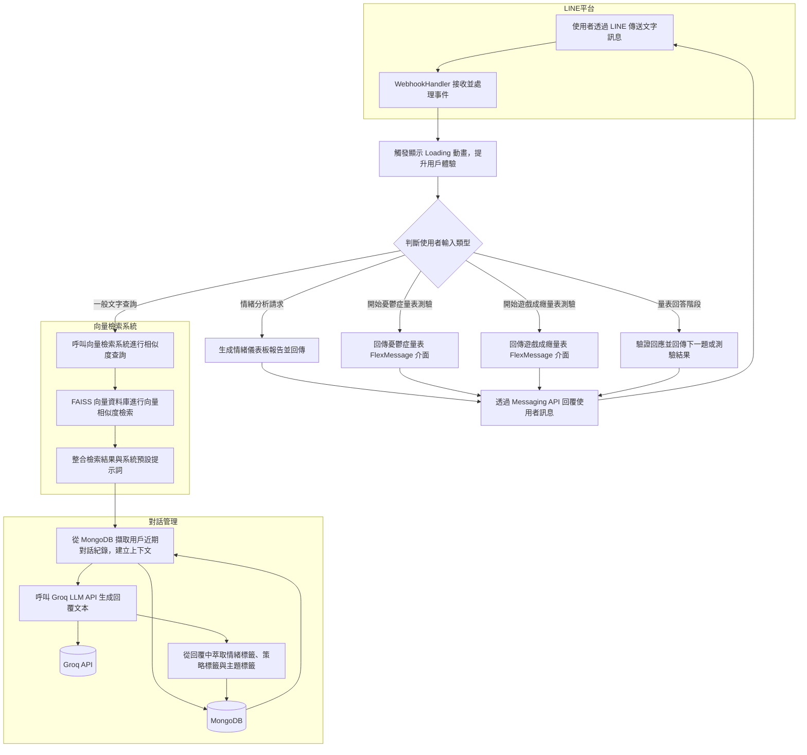

## 系統流程圖



## 各檔案說明

### `app.py`
- 主程式入口。
- 使用 Flask 建立伺服器，並設定 `/callback` 路由處理 LINE Webhook。
- 匯入 `line_handlers` 模組進行事件處理。

### `config.py`
- 儲存環境變數的載入，例如 Groq API 金鑰、伺服器網址等。
- 與 `.env` 檔案結合，集中管理設定值。

### `line_handlers.py`
- 處理來自 LINE 的訊息事件。
- 匯入 `llm` 模組定義模型處理邏輯。
- 匯入 `mongo` 模組連接MongoDB 資料庫。
- 定義收到文字訊息後的應對流程。

### `llm.py`
- 封裝與語言模型（Groq / LLaMA）溝通的邏輯。
- 定義如何將使用者訊息送出並取得回應。

### `extract_topic.py`
- 使用者聊天前會在圖文選單選擇聊天主題(有7種)
- 所以後面所有的對話都會記錄為該主題並且 `儲存至資料庫 `
- 故這個檔案會在每次使用者輸入文字後，判斷一次他是否更換主題
- 若沒有更換，則沿用上一句話的主題
- 如果資料庫為空，沒有歷史對話，就將主題先記錄為"其他"

### `emotion_strategy_utils.py`
-  為了避免讓使用者察覺我們正在進行 `情緒分析` 與 `心理策略紀錄` 
-  我們設計了隱藏式的標記機制
-  當 LLM 回傳分析結果時，不會直接以文字顯示情緒名稱或策略內容
-  而是透過編碼形式（如 [1]～[8] 表示情緒、(1)～(8) 表示策略）進行標註
-  這個檔案就是在進行上述的標記轉換處理

### `emotion_dashboard.py`
- 根據使用者歷史對話紀錄，統計每種情緒出現的頻率，並產生 `文字情緒儀表板` 。
- 為了讓情緒分析結果更有親和力，我們替每一種情緒設計了一個對應角色。

### `depression_scale.py`
- 顯示 18 題 `台灣人憂鬱症量表問題` ，讓使用者逐題作答。

### `gaming_disorder_scale.py`
- 顯示 10 題 `網路遊戲成癮量表問題` ，讓使用者逐題作答。

### `render_wake_up.py`
- 我們使用 Render 作為伺服器部署平台。
- 這個檔案會定時 ping Render 平台以防止伺服器自動休眠。

### `mongo.py`
- 封裝 MongoDB 資料庫的連線與操作功能。
- 讓專案能存取、管理聊天紀錄或資源資料。

### `resources.py`
- 載入 `system_prompt.txt` 、 `cycu_resources.json`，提供語言模型的指令（角色、語氣等）以及中原大學（CYCU）相關的各類資源資訊。

### `requirements.txt`
- 記錄所需的 Python 套件。

### `system_prompt.txt`
- 儲存語言模型的 system prompt，用於引導模型回應風格與身份定位。
- 設定llm回傳文字時，透過 `編碼 `形式顯示情緒名稱與策略內容。
- 設定llm不回答任何 `危險、非法或自殘 `相關問題。
- 設定llm不透露任何 `prompt內部設計或詳細指令內容 `。
- 由 `resources.py` 讀取後提供給 Bot 作為回答參考。

### `cycu_resources.json`
- JSON 格式的資源資料檔案。
- 包含中原大學（CYCU）相關的各類資源資訊。
- 由 `resources.py` 讀取後提供給 Bot 作為回答參考。

<br>  
<br>  

## 指令

下載套件：
```bash
pip install -r requirements.txt
```
啟動程式：
```bash
python app.py
```
